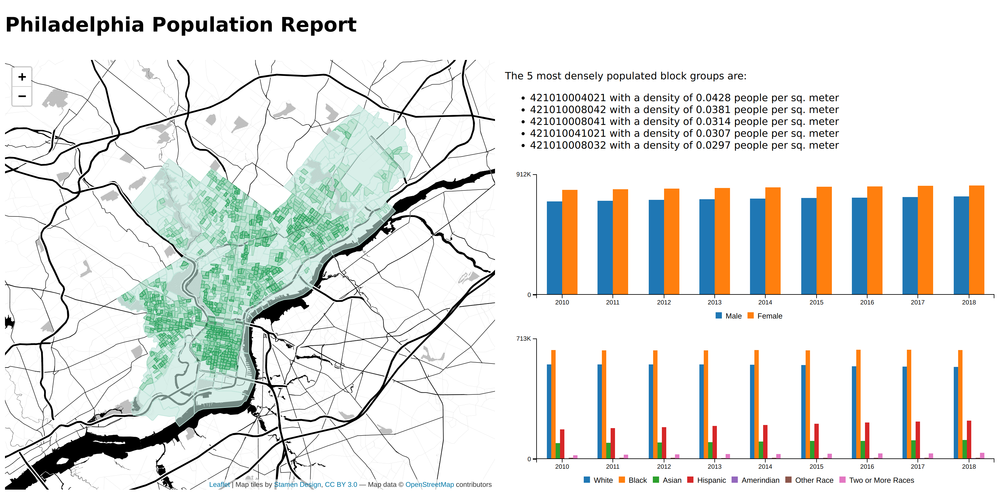

# Lab: Modeling and Rendering Data

In this lab we will implement the following dashboard by modeling data in BigQuery and rendering Jinja templates.



We will be using data from the US Census to implement the dashboard. Specifically, the following public BigQuery datasets:
* `bigquery-public-data.census_bureau_acs.blockgroup_2010_5yr` through `..._2018_5yr`
  * Specific useful fields:
    * `geo_id`
    * `total_pop`
    * `male_pop`
    * `female_pop`
    * `white_pop`
    * `black_pop`
    * `asian_pop`
    * `hispanic_pop`
    * `amerindian_pop`
    * `other_race_pop`
    * `two_or_more_races_pop`
* `bigquery-public-data.geo_census_blockgroups.blockgroups_42` (`42` is the FIPS code for Pennsylvania)
  * Specific useful fields:
    * `geo_id`
    * `blockgroup_geom`
    * `county_fips_code` (Philadelphia is county `101`)

## Process

0.  _(optional)_ Fork this repository to your account, if you want to keep your work.

1.  Clone this repository (or your forked version) to your computer.

1.  Create a virtual environment with the following packages installed: `pandas`, `geopandas`, `pandas-gbq`, `google-cloud-bigquery-storage`, `google-cloud-storage`, `jinja2`.

1.  Modify the code at the beginning of _src/transform_data.py_ and _src/render_report.py_ to point to the location of your GCP service account credentials (create a new [service account](https://console.cloud.google.com/iam-admin/serviceaccounts) or download new keys if you don't have any around).

1.  Run the render report script, just to make sure that everything is installed and configured correctly:

    ```bash
    python src/render_report.py
    ```

    After running, you should have a file called _output/index.html_. You should be able to open that in a browser (it won't be very exciting ... yet).

### Create and run data model(s)

5.  In the Google Cloud Platform console, create a BigQuery dataset named `lab09`.

1.  Implement the query needed in the _src/sql/lab09/model_blockgroups.sql_ model file. Use the [BigQuery console](https://console.cloud.google.com/bigquery) as necessary to explore data. Alternatively, if it is more comfortable, you can use a Jupyter notebook to explore the data.

1.  Run the data transformations module to create the blockgroups model and its downstream tables.

    ```bash
    python src/transform_data.py
    ```

    Ensure that the tables that you expect were created in your BigQuery account. See the [Troubleshooting](#troubleshooting) section below if you get an error while running the script.

### Add map data into the report

8.  Read and understand the following code. What it does is:
    1.  Uses a `SELECT` query to read the `blockgroups_mapdata` table into a Pandas `DataFrame`. This will include geographic data formatted as WKT strings.
    2.  Converts the geospatial column (`blockgroup_geom`) into geometry objects in memory.
    3.  Creates a GeoPandas `GeoDataFrame`, which knows how to output the data as GeoJSON, which is something we can't get from a normal Pandas `DataFrame`.

    ```py
    mapdata_df = pd.read_gbq('SELECT * FROM lab09.blockgroups_mapdata')
    mapdata_df.blockgroup_geom = gpd.GeoSeries.from_wkt(mapdata_df.blockgroup_geom)
    mapdata_gdf = gpd.GeoDataFrame(mapdata_df, geometry='blockgroup_geom')
    ```

    In the _render_report.py_ module, paste the above code in place of the ellipses (`...`) under the `# Download the map data.` comment. Then, under the line that says `# TEMPLATE DATA GOES HERE`, add the following:

    ```py
    mapdata=mapdata_gdf.to_json(),
    ```

    That will make a GeoJSON representation of the map data available in the template in a variable named `mapdata`.

1.  In your _index.html_ template, find the line that says `var densitymapdata = null;`. Replace this line with the following:

    ```js
    var densitymapdata = {{ mapdata }};
    ```

1.  Run the _render_report.py_ script again (in the same way as in step #4) and ensure that you have map data on your map.

### Add chart data into the report

11. Read and understand the following code:

    ```py
    chartdata_df = pd.read_gbq('SELECT * from lab09.blockgroups_chartdata')
    ```

    Since we're not concerned about any geospatial fields in this data, we don't need to convert it to a `GeoDataFrame`. Add the above line to _render_report.py_ module, replacing the elipses (`...`) below `# Download the chart data.`. Then, add the following to the template data:

    ```py
    chartdata=chartdata_df.to_dict('list'),
    ```

    That line should make a dictionary of data available in the template under the name `chartdata`. The dictionary will be formatted with a **list** of values corresponding to each field. For example:

    ```py
    {
        'year': [ ... ],
        'total_male_pop': [ ... ],
        'total_female_pop': [ ... ],
        'total_white_pop': [ ... ],
        'total_black_pop': [ ... ],
        ...
    }
    ```

    Each of the lists will have values in the same order, going from the top to the bottom of the query results.

1.  In your _index.html_ template, find the following lines:
    ```js
    var sexchartdata = [
        [ 'Year', ...[] ],
        [ 'Male', ...[] ],
        [ 'Female', ...[] ],
    ];
    ```

    Replace those lines with the following:
    ```js
    var sexchartdata = [
        ['Year', ...{{ chartdata['year'] }}],
        ['Male', ...{{ chartdata['total_male_pop'] }}],
        ['Female', ...{{ chartdata['total_female_pop'] }}]
    ];
    ```

1.  In your _index.html_ template, find the following lines:
    ```js
    var racechartdata = [
        [ 'Year', ...[] ],
        [ 'White', ...[] ],
        [ 'Black', ...[] ],
        [ 'Asian', ...[] ],
        [ 'Hispanic', ...[] ],
        [ 'Amerindian', ...[] ],
        [ 'Other Race', ...[] ],
        [ 'Two or More Races', ...[] ],
    ];
    ```

    Replace those lines with the following:
    ```js
    var racechartdata = [
        ['Year', ...{{ chartdata['year'] }}],
        ['White', ...{{ chartdata['total_white_pop'] }}],
        ['Black', ...{{ chartdata['total_black_pop'] }}],
        ['Asian', ...{{ chartdata['total_asian_pop'] }}],
        ['Hispanic', ...{{ chartdata['total_hispanic_pop'] }}],
        ['Amerindian', ...{{ chartdata['total_amerindian_pop'] }}],
        ['Other Race', ...{{ chartdata['total_other_race_pop'] }}],
        ['Two or More Races', ...{{ chartdata['total_two_or_more_races_pop'] }}],
    ];
    ```

1.  Run the _render_report.py_ script again (in the same way as in step #4) and ensure that you have data in your charts.

### Add textual data into the report

15.  Read and understand the following code:

    ```py
    listdata_df = pd.read_gbq('SELECT * from lab09.blockgroups_listdata')
    ```

    Add the above line to _render_report.py_ module, replacing the elipses (`...`) below `# Download the population density list data.`. Then, add the following to the template data:

    ```py
    listdata=listdata_df.to_dict('records'),
    ```

    That line should make a list of dictionaries, one for each **record** in the `blockgroups_listdata` table, and make it available in the template under the name `listdata`. The list will be formatted similar to:

    ```py
    [
        {'year': 2018, 'geo_id': '421010183001', pop_density: ...},
        {'year': 2018, 'geo_id': '421010359002', pop_density: ...},
        {'year': 2018, 'geo_id': '421010168006', pop_density: ...},
        ...
    ]
    ```

1.  In your _index.html_ template, find the following lines:
    ```html
    <div id="densitylist">
    </div>
    ```

    Add the following code _inside_ of that `div` element:
    ```html+jinja
    <p>The 5 most densely populated block groups during {{ listdata[0].year }} are:</p>
    <ul>
      
        <li>{{ record.geo_id }} with a density of {{ record.pop_density | round(4) }} people per sq. meter</li>
      
    </ul>
    ```

1.  Run the _render_report.py_ script again (in the same way as in step #4) and ensure that you have data in your list.

## Definitions

* **Data Model**: Data modeling is a process used to define data requirements needed to support a business processes. A data model is a design that dictates how pieces of data relate to one another to support those processes.

  Often in a data model you will have a table for each significant noun within your domain. It is increasingly common for each one of these tables themselves to be called a **model** (I think largely due to the influence of [DBT](https://docs.getdbt.com/docs/building-a-dbt-project/building-models)).

* **Upstream/Downstream**: If one model (_B_) depends on another model (_A_) having been created, then we say that _B_ is downstream of _A_, or _A_ is upstream of _B_.

## Troubleshooting
* If you see an error like:
  ```
  Forbidden: 403 POST https://bigquery.googleapis.com/bigquery/v2/projects/.../ jobs?prettyPrint=false: Access Denied: Project ...: User does not have  bigquery.jobs.create permission in project ...
  ```
  Then you need to set your `GOOGLE_APPLICATION_CREDENTIALS` value.

* If you see an error like:
  ```
  404 Not found: Dataset ...:lab09 was not found in location ...
  ```
  Then you probably didn't create the `lab09` dataset in BigQuery.
